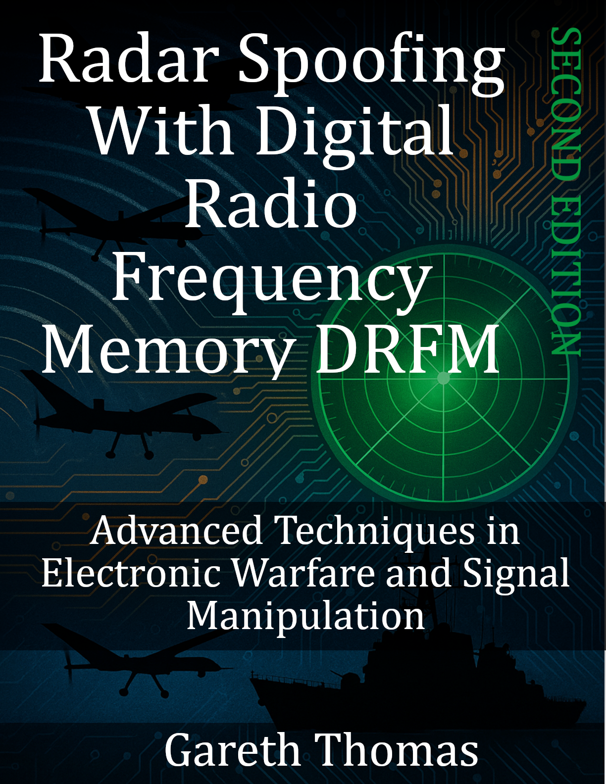

# Radar Spoofing With Digital Radio Frequency Memory Drfm

### Cover

### Repository Structure
- `covers/`: Book cover images
- `blurbs/`: Promotional blurbs
- `infographics/`: Marketing visuals
- `source_code/`: Code samples
- `manuscript/`: Drafts and format.txt for TOC
- `marketing/`: Ads and press releases
- `additional_resources/`: Extras

View the live site at [burstbookspublishing.github.io/radar-spoofing-with-digital-radio-frequency-memory-drfm](https://burstbookspublishing.github.io/radar-spoofing-with-digital-radio-frequency-memory-drfm/)
---

## Chapter 1. Introduction to Digital Radio Frequency Memory (DRFM)
### Section 1. Understanding DRFM Basics
- What is DRFM?
- Historical Development of DRFM
- Overview of Key Components

### Section 2. Role of DRFM in Electronic Warfare
- Electronic Warfare Fundamentals
- Evolution of Radar Deception Techniques
- Importance of DRFM in Modern Warfare

---
## Chapter 2. Technical Foundation of DRFM Systems
### Section 1. Signal Processing Basics
- Analog and Digital Signals
- Frequency and Phase Modulation
- Sampling Theorem and Quantization

### Section 2. Components of DRFM Technology
- Analog-to-Digital Converters (ADC)
- Digital Storage and Memory Management
- Digital-to-Analog Converters (DAC)
- Signal Processing Algorithms

### Section 3. Data Processing in DRFM Systems
- Signal Capture and Conversion
- Real-Time Digital Processing
- Challenges in Signal Fidelity and Latency

---
## Chapter 3. DRFM Signal Manipulation Techniques
### Section 1. Basics of Radar Signal Manipulation
- Radar Cross Section (RCS) and Reflection
- Importance of Phase, Amplitude, and Timing

### Section 2. Common Manipulation Techniques
- Range Gate Pull-Off (RGPO)
- Velocity Gate Pull-Off (VGPO)
- Amplitude and Phase Modulation

### Section 3. Advanced Signal Deception Techniques
- Doppler Shifts and Velocity Deception
- Coherent and Non-Coherent Spoofing
- Multi-Target Generation and False Targets

---
## Chapter 4. Applications of DRFM in Electronic Warfare
### Section 1. Offensive Applications in Warfare
- Radar Jamming and Deception
- DRFM in Anti-Ship and Anti-Air Defense
- Using DRFM in Cyber-Physical Warfare

### Section 2. Defensive Countermeasures
- Radar Hardening Techniques
- DRFM Detection Technologies
- ECCM (Electronic Counter-Countermeasures)

### Section 3. Civilian Applications and Testing
- Radar System Testing and Calibration
- Simulated Target Generation for Training
- Potential for Civilian Air Traffic Control

---
## Chapter 5. Signal Processing Techniques in DRFM
### Section 1. Fourier Analysis and Digital Filters
- Understanding Fourier Transform
- FIR and IIR Filters

### Section 2. Advanced Digital Signal Processing (DSP) Techniques
- Digital Filtering for Noise Reduction
- Pulse Compression and Chirp Modulation
- Adaptive Filtering Techniques in DRFM

### Section 3. Real-Time Processing and Data Handling
- Low-Latency Requirements
- High-Speed Memory and Buffering
- FPGA and ASIC Implementations for DRFM

---
## Chapter 6. Hardware Design of DRFM Systems
### Section 1. Hardware Components in DRFM
- ADC and DAC Technologies
- Memory Storage: SRAM vs. DRAM in DRFM
- Microcontrollers, FPGAs, and DSP Processors

### Section 2. High-Speed Data Processing Requirements
- Clock Speed and Synchronization
- Bandwidth and Sampling Rate Challenges
- Thermal and Power Management in DRFM

### Section 3. System Integration and Testing
- Hardware/Software Co-Design
- Signal Fidelity Testing
- Reliability and Robustness in Field Conditions

---
## Chapter 7. Case Studies and Practical Applications
### Section 1. DRFM in Military Exercises
- Case Study: Airborne and Naval DRFM Systems
- Lessons Learned from Recent Conflicts

### Section 2. Civilian and Industrial Applications
- DRFM in Radar Calibration Facilities
- Non-Military Electronic Countermeasures

### Section 3. Future Trends and Technological Challenges
- Emerging Technologies in DRFM
- Ethical and Regulatory Considerations
- Future of DRFM in Warfare and Peacekeeping

---
## Chapter 8. Future of DRFM in Electronic Warfare
### Section 1. Counter-DRFM Technologies
- Radar Hardening Techniques
- Artificial Intelligence and DRFM Detection

### Section 2. Advancements in DRFM Technology
- Machine Learning in DRFM Systems
- Quantum Computing Implications for DRFM
- Autonomous Systems with DRFM Capabilities

### Section 3. Ethics and Implications for Global Security
- Legal Frameworks and Regulations
- Humanitarian Concerns
- International Agreements and Arms Control
- Appendices
- Appendix A. Glossary of Terms
- Appendix B. Technical Standards and Protocols
- Appendix C. DRFM Software and Hardware Resources
- Appendix D. Key DRFM Patents and Innovations
---
